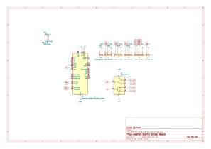
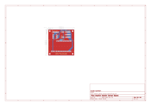

# Weather Station Sensor

This weather station aims to collect environment data, like temperature,
humidity and pressure via sensors connected over I2C to a microcontroller,
mounted on a Adafruit feather board. The collected data then gets aggregated
and sent out via a serial connection (RS485). This happens in a predefined
time interval, by default every minute.

## Repositories

- [Firmware](https://github.com/flavian112/weather_station_sensor_firmware.git)
- [Board](https://github.com/flavian112/weather_station_sensor_board.git)

## Resources

- [Adafruit M0 Basic Proto Pinout](./datasheets/adafruit_feather_m0_basic_proto_pinout.pdf)
- [SAMD21 Datasheet](./datasheets/atmel_samd21_datasheet.pdf)
- [BME280 Datasheet](./datasheets/bosch_bme280_datasheet.pdf)
- [MAX3490 Datasheet](./datasheets/maxim_integrated_max3490_datasheet.pdf)

## Files

### Schematic

### Board

### 3D View

## Sensors

### Precipitation Meter

This Precipitation Meter has an internal reed switch, which closes for a short
pulse whenever the bucket tips. 1mm of precipitation fills around 2.84 buckets.
